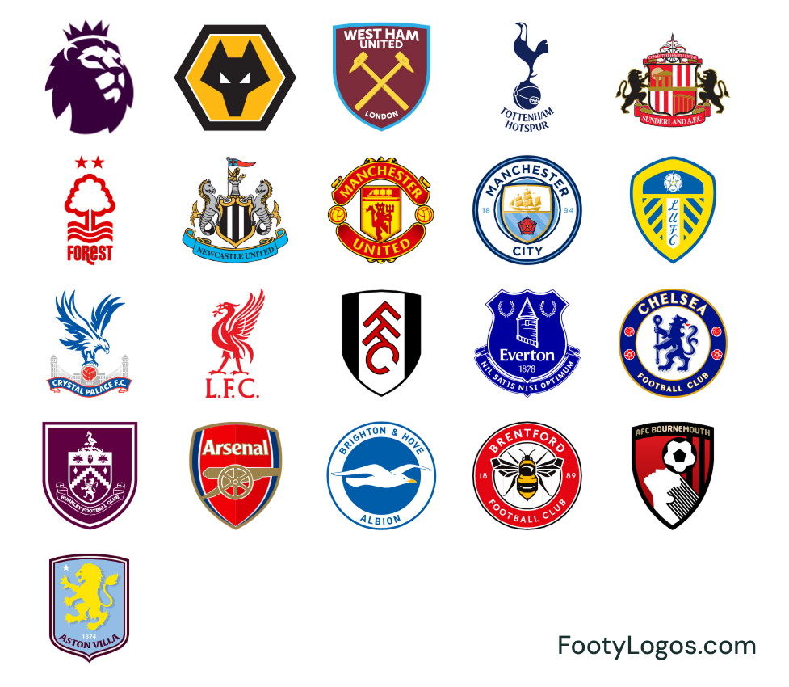
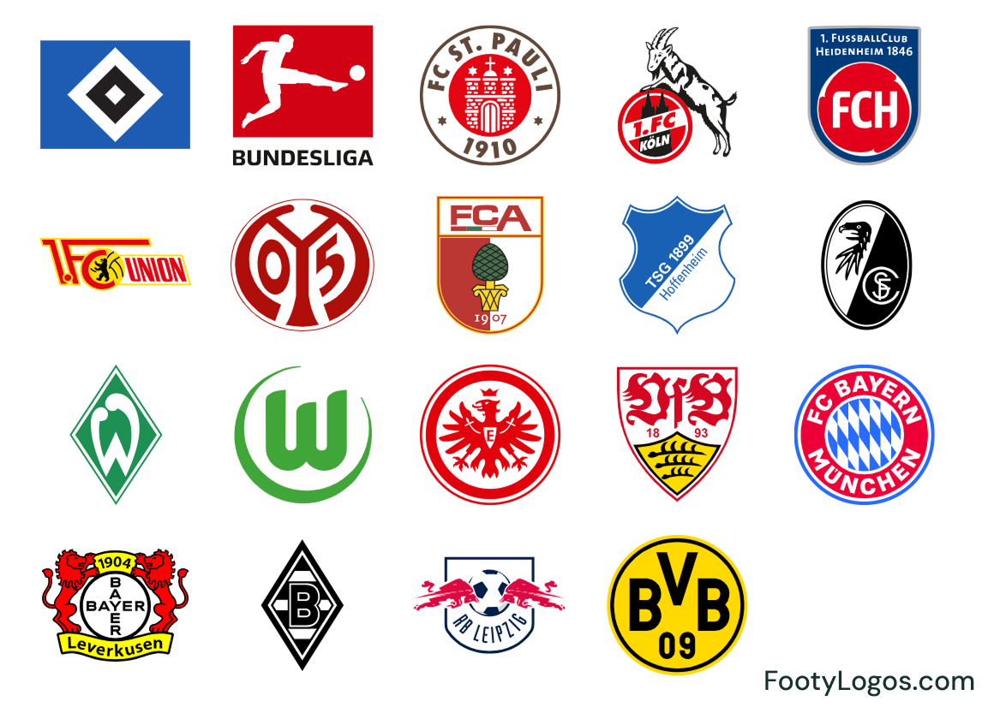
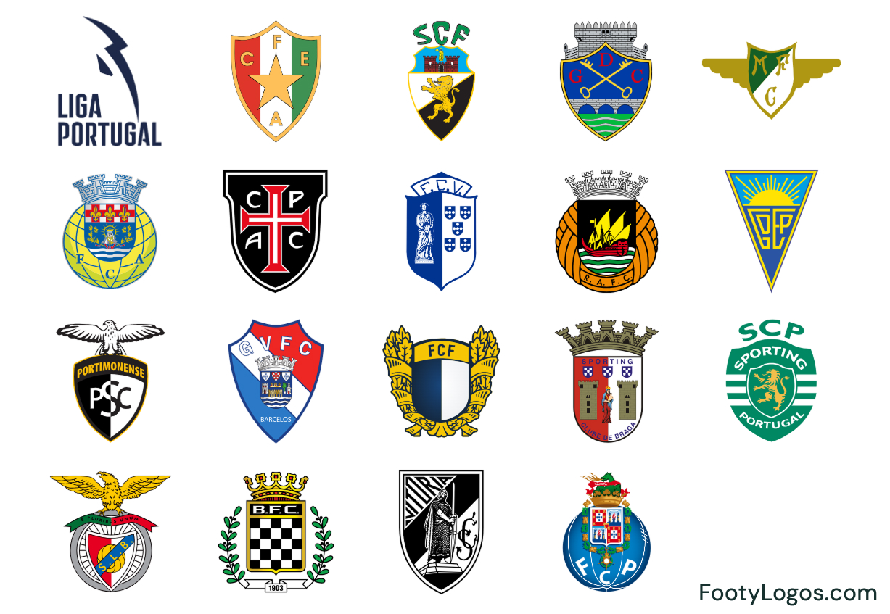
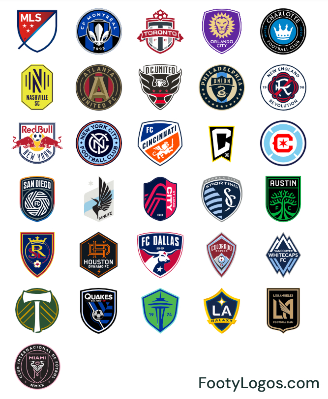

# FootyLogos.com – clean football logo library

[FootyLogos.com](https://www.footylogos.com) is a football-only logo library for people who **design, collect, analyse, or simply love football crests**.

We’re building a large, structured database of **club badges, national team emblems, league and tournament logos**, downloadable as clean PNG and SVG files with transparent backgrounds. Logos are organised by country, league and competition, with variants when available (primary crest, monochrome versions, anniversary badges, wordmarks, icons, etc.).

> 👉 Explore the full library: **https://www.footylogos.com**

---

## Who is it for?

- **Football graphics creators** – thumbnails, FM skins, overlays, social posts, wallpapers.
- **Analysts & data projects** – scouting decks, dashboards, infographics.
- **Bloggers, editors & media** – match previews, season guides, team pages.
- **Collectors & badge nerds** – anyone obsessed with crest history and details.

Each logo page on [FootyLogos.com](https://www.footylogos.com) is structured for **quick reuse**:
consistent naming, clean file formats, transparent backgrounds, and related teams/competitions.

---

## Sample competitions in this repo

This GitHub repository only contains a few **preview sheets** – custom images showing all clubs in a competition on one canvas. For full-resolution PNG/SVG downloads, use the links below.

### 🇬🇧 Premier League logos

- Browse all **Premier League logos** on FootyLogos:  
  https://www.footylogos.com/competition/premier-league

### 🇮🇹 Serie A logos

- Browse all **Serie A logos** on FootyLogos:  
  https://www.footylogos.com/competition/serie-a

### 🇪🇸 LaLiga logos

- Browse all **LaLiga logos** on FootyLogos:  
  https://www.footylogos.com/competition/laliga

### 🇩🇪 Bundesliga logos

- Browse all **Bundesliga logos** on FootyLogos:  
  https://www.footylogos.com/competition/bundesliga

### 🇫🇷 Ligue 1 logos

- Browse all **Ligue 1 logos** on FootyLogos:  
  https://www.footylogos.com/competition/ligue-1

### 🇧🇷 Brasileirão Série A logos

- Browse all **Brasileirão Série A logos** on FootyLogos:  
  https://www.footylogos.com/competition/brasileirao-serie-a

### 🇳🇱 Eredivisie logos

- Browse all **Eredivisie logos** on FootyLogos:  
  https://www.footylogos.com/competition/eredivisie

### 🇦🇷 Liga Profesional (Argentina) logos

- Browse all **Liga Profesional (Argentina) logos** on FootyLogos:  
  https://www.footylogos.com/competition/liga-profesional-argentina

### 🇲🇽 Liga MX logos

- Browse all **Liga MX logos** on FootyLogos:  
  https://www.footylogos.com/competition/liga-mx

### 🇵🇹 Liga Portugal logos

- Browse all **Liga Portugal logos** on FootyLogos:  
  https://www.footylogos.com/competition/liga-portugal

### 🇺🇸 MLS logos

- Browse all **MLS logos** on FootyLogos:  
  https://www.footylogos.com/competition/mls

  FootyLogos also covers 70+ other national leagues worldwide – full index on: https://www.footylogos.com/competitions

---

## How to use FootyLogos.com

- Search by **club**, **country**, or **competition**.
- Open a team or tournament page to:
  - Preview the **main crest** and its variants.
  - Download **PNG** or **SVG** versions with transparent backgrounds.
- Use the files in:
  - Football Manager kits/skins, custom graphics and wallpapers.
  - Articles, newsletters, and social media content (within fair editorial use).

---

## Credits & trademarks

All club and competition logos are used **for identification and editorial/reference purposes only**.  
**Trademarks and copyrights belong to their respective owners.**

This repository and [FootyLogos.com](https://www.footylogos.com) are unofficial and not endorsed by any league, club, or federation.
